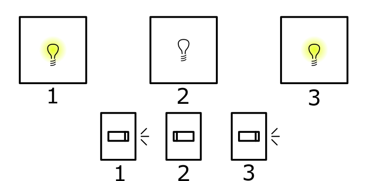

<H1>Questão 4</H1>

Temos o seguinte cenário:

Acionamos os interruptores 1 e 2, e observamos que a sala 1 está com a lâmpada acesa:

Com isso, podemos inverter os interruptores 2 e 3 e observar a sala 3.
Percebemos que o interruptor 3 não pertence à sala 1, pois estão em estados diferentes.

<H2>Hipótese 1 - A sala 3 está com a lâmpada apagada</H2>

Como o interruptor 3 não pertence à sala 1, e podemos ver que o 2 pertence à sala 3, concluímos o cenário seguinte:

<H2>Hipótese 2 - A sala 3 está com a lâmpada acesa</H2>

Partindo da hipótese 1, concluímos aqui o cenário seguinte:

